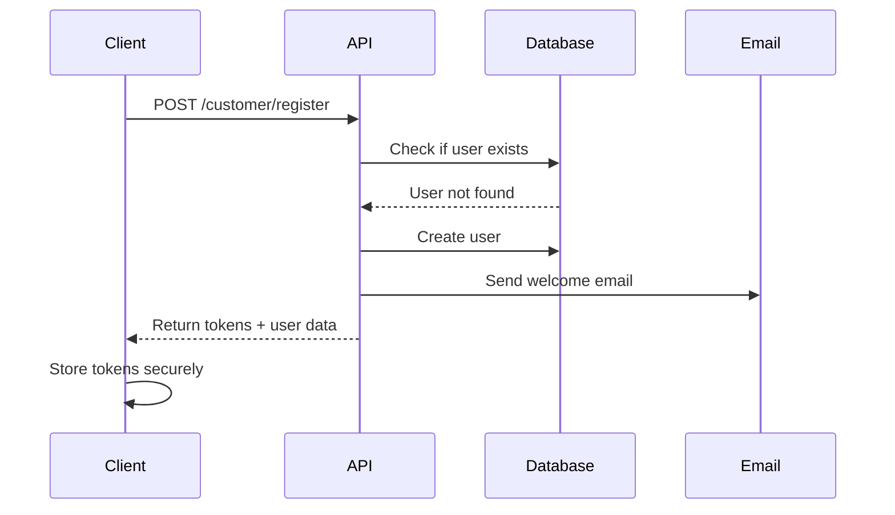
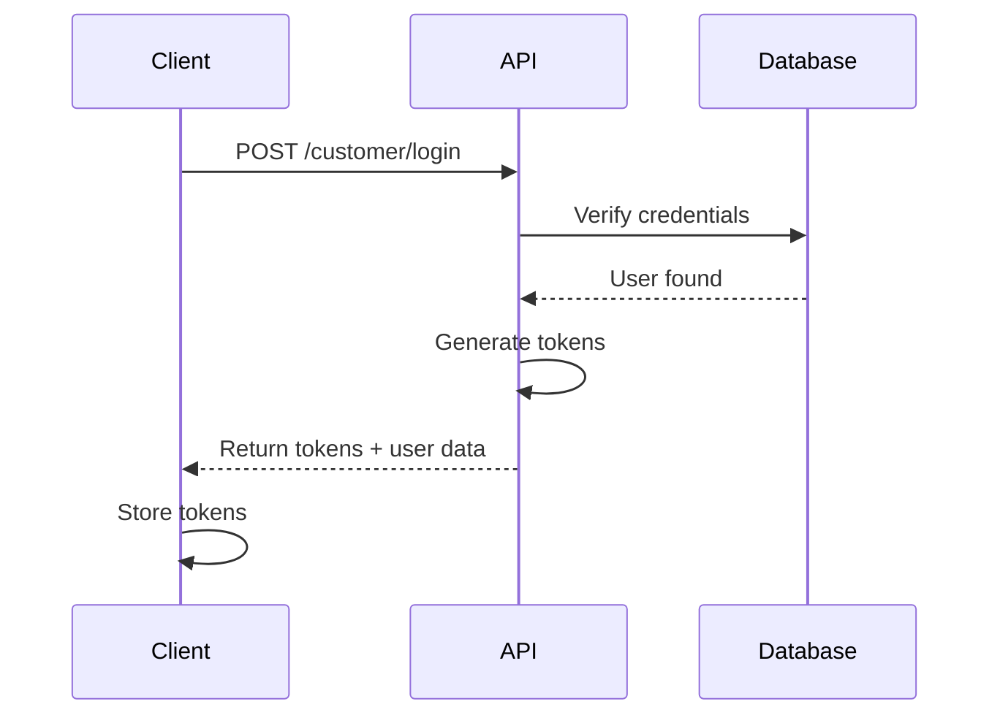
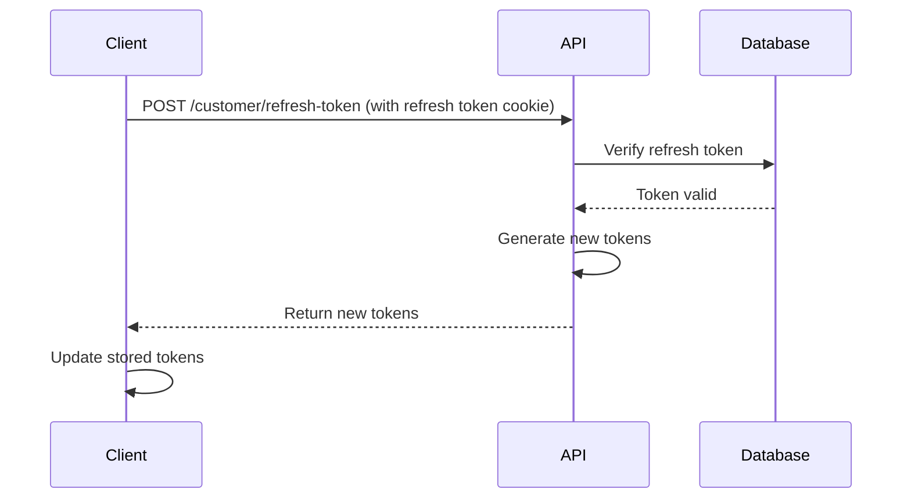

# 🔗 Integration Guide

Complete guide for integrating with the NavSwap EV Charging Platform.

---

## 📋 Table of Contents

- [Overview](#overview)
- [Getting Started](#getting-started)
- [Authentication Flow](#authentication-flow)
- [Integration Patterns](#integration-patterns)
- [Frontend Integration](#frontend-integration)
- [Mobile App Integration](#mobile-app-integration)
- [Backend Integration](#backend-integration)
- [Webhooks](#webhooks)
- [Testing](#testing)
- [Production Checklist](#production-checklist)

---

## Overview

The NavSwap platform provides two main integration points:

1. **Authentication API** - User management and authentication
2. **Recommendation API** - EV charging station recommendations (coming soon)

---

## Getting Started

### Prerequisites

- Node.js 18+ or Python 3.9+
- API credentials (contact support@navswap.com)
- Basic understanding of REST APIs and JWT

### Quick Start

1. **Get API Access**
   ```bash
   # Contact support to get your API credentials
   # You'll receive:
   # - Base URL
   # - API Key (if applicable)
   # - Environment (dev/staging/prod)
   ```

2. **Install SDK** (Optional)
   ```bash
   # JavaScript
   npm install @navswap/sdk
   
   # Python
   pip install navswap-sdk
   ```

3. **Test Connection**
   ```bash
   curl http://localhost:8000/api/v1/healthcheck
   ```

---

## Authentication Flow

### 1. Registration Flow



**Implementation:**

```javascript
// Step 1: Register user
const registerUser = async (userData) => {
  try {
    const response = await fetch('http://localhost:8000/api/v1/customer/register', {
      method: 'POST',
      headers: {
        'Content-Type': 'application/json'
      },
      credentials: 'include', // Important for cookies
      body: JSON.stringify(userData)
    });
    
    const data = await response.json();
    
    if (data.success) {
      // Store access token
      localStorage.setItem('access_token', data.data.access_token);
      // Refresh token is stored in HTTP-only cookie automatically
      return data.data.user;
    } else {
      throw new Error(data.message);
    }
  } catch (error) {
    console.error('Registration failed:', error);
    throw error;
  }
};

// Usage
const newUser = await registerUser({
  full_name: 'Alice Smith',
  email: 'alice@example.com',
  password: 'SecurePass123!',
  phone_number: '5551234567',
  addhar_card_number: '555123456789',
  country_code: '+1',
  role: 'customer',
  vehicle_type: 'Tesla Model 3',
  vehicle_number: 'CA-1234'
});
```

---

### 2. Login Flow



**Implementation:**

```javascript
const loginUser = async (email, password) => {
  try {
    const response = await fetch('http://localhost:8000/api/v1/customer/login', {
      method: 'POST',
      headers: {
        'Content-Type': 'application/json'
      },
      credentials: 'include',
      body: JSON.stringify({ email, password })
    });
    
    const data = await response.json();
    
    if (data.success) {
      localStorage.setItem('access_token', data.data.access_token);
      return data.data.user;
    } else {
      throw new Error(data.message);
    }
  } catch (error) {
    console.error('Login failed:', error);
    throw error;
  }
};
```

---

### 3. Token Refresh Flow



**Implementation:**

```javascript
const refreshAccessToken = async () => {
  try {
    const response = await fetch('http://localhost:8000/api/v1/customer/refresh-token', {
      method: 'POST',
      credentials: 'include' // Sends refresh token cookie
    });
    
    const data = await response.json();
    
    if (data.success) {
      localStorage.setItem('access_token', data.data.access_token);
      return data.data.access_token;
    } else {
      // Refresh token expired, redirect to login
      window.location.href = '/login';
    }
  } catch (error) {
    console.error('Token refresh failed:', error);
    window.location.href = '/login';
  }
};

// Auto-refresh before token expires
setInterval(refreshAccessToken, 14 * 60 * 1000); // Refresh every 14 minutes
```

---

### 4. Authenticated Requests

```javascript
const makeAuthenticatedRequest = async (url, options = {}) => {
  const accessToken = localStorage.getItem('access_token');
  
  const response = await fetch(url, {
    ...options,
    headers: {
      ...options.headers,
      'Authorization': `Bearer ${accessToken}`,
      'Content-Type': 'application/json'
    },
    credentials: 'include'
  });
  
  // Handle 401 Unauthorized
  if (response.status === 401) {
    // Try to refresh token
    await refreshAccessToken();
    // Retry request
    return makeAuthenticatedRequest(url, options);
  }
  
  return response.json();
};

// Usage
const user = await makeAuthenticatedRequest('http://localhost:8000/api/v1/customer/current-user');
```

---

## Integration Patterns

### Pattern 1: API Wrapper Class

```javascript
class NavSwapAPI {
  constructor(baseURL = 'http://localhost:8000/api/v1') {
    this.baseURL = baseURL;
    this.accessToken = localStorage.getItem('access_token');
  }
  
  async request(endpoint, options = {}) {
    const url = `${this.baseURL}${endpoint}`;
    const config = {
      ...options,
      headers: {
        'Content-Type': 'application/json',
        ...options.headers
      },
      credentials: 'include'
    };
    
    if (this.accessToken) {
      config.headers['Authorization'] = `Bearer ${this.accessToken}`;
    }
    
    const response = await fetch(url, config);
    
    if (response.status === 401) {
      await this.refreshToken();
      return this.request(endpoint, options);
    }
    
    return response.json();
  }
  
  async register(userData) {
    const data = await this.request('/customer/register', {
      method: 'POST',
      body: JSON.stringify(userData)
    });
    
    if (data.success) {
      this.setToken(data.data.access_token);
    }
    
    return data;
  }
  
  async login(email, password) {
    const data = await this.request('/customer/login', {
      method: 'POST',
      body: JSON.stringify({ email, password })
    });
    
    if (data.success) {
      this.setToken(data.data.access_token);
    }
    
    return data;
  }
  
  async logout() {
    const data = await this.request('/customer/logout', {
      method: 'POST'
    });
    
    this.clearToken();
    return data;
  }
  
  async getCurrentUser() {
    return this.request('/customer/current-user');
  }
  
  async updateProfile(updates) {
    return this.request('/customer/update-profile', {
      method: 'PATCH',
      body: JSON.stringify(updates)
    });
  }
  
  async refreshToken() {
    const data = await this.request('/customer/refresh-token', {
      method: 'POST'
    });
    
    if (data.success) {
      this.setToken(data.data.access_token);
    }
    
    return data;
  }
  
  setToken(token) {
    this.accessToken = token;
    localStorage.setItem('access_token', token);
  }
  
  clearToken() {
    this.accessToken = null;
    localStorage.removeItem('access_token');
  }
}

// Usage
const api = new NavSwapAPI();

// Register
await api.register({
  full_name: 'Alice Smith',
  email: 'alice@example.com',
  password: 'SecurePass123!',
  phone_number: '5551234567',
  addhar_card_number: '555123456789',
  country_code: '+1',
  role: 'customer'
});

// Login
await api.login('alice@example.com', 'SecurePass123!');

// Get current user
const user = await api.getCurrentUser();

// Update profile
await api.updateProfile({
  vehicle_type: 'Tesla Model Y'
});

// Logout
await api.logout();
```

---

### Pattern 2: React Hooks

```javascript
// useAuth.js
import { createContext, useContext, useState, useEffect } from 'react';

const AuthContext = createContext();

export const AuthProvider = ({ children }) => {
  const [user, setUser] = useState(null);
  const [loading, setLoading] = useState(true);
  const api = new NavSwapAPI();
  
  useEffect(() => {
    // Check if user is logged in on mount
    const checkAuth = async () => {
      try {
        const data = await api.getCurrentUser();
        if (data.success) {
          setUser(data.data.user);
        }
      } catch (error) {
        console.error('Auth check failed:', error);
      } finally {
        setLoading(false);
      }
    };
    
    checkAuth();
  }, []);
  
  const register = async (userData) => {
    const data = await api.register(userData);
    if (data.success) {
      setUser(data.data.user);
    }
    return data;
  };
  
  const login = async (email, password) => {
    const data = await api.login(email, password);
    if (data.success) {
      setUser(data.data.user);
    }
    return data;
  };
  
  const logout = async () => {
    await api.logout();
    setUser(null);
  };
  
  const updateProfile = async (updates) => {
    const data = await api.updateProfile(updates);
    if (data.success) {
      setUser(data.data.user);
    }
    return data;
  };
  
  return (
    <AuthContext.Provider value={{ user, loading, register, login, logout, updateProfile }}>
      {children}
    </AuthContext.Provider>
  );
};

export const useAuth = () => {
  const context = useContext(AuthContext);
  if (!context) {
    throw new Error('useAuth must be used within AuthProvider');
  }
  return context;
};

// Usage in components
function LoginPage() {
  const { login } = useAuth();
  const [email, setEmail] = useState('');
  const [password, setPassword] = useState('');
  
  const handleSubmit = async (e) => {
    e.preventDefault();
    try {
      await login(email, password);
      // Redirect to dashboard
    } catch (error) {
      alert('Login failed: ' + error.message);
    }
  };
  
  return (
    <form onSubmit={handleSubmit}>
      <input value={email} onChange={(e) => setEmail(e.target.value)} />
      <input type="password" value={password} onChange={(e) => setPassword(e.target.value)} />
      <button type="submit">Login</button>
    </form>
  );
}

function Dashboard() {
  const { user, logout } = useAuth();
  
  if (!user) {
    return <Navigate to="/login" />;
  }
  
  return (
    <div>
      <h1>Welcome, {user.full_name}!</h1>
      <button onClick={logout}>Logout</button>
    </div>
  );
}
```

---

## Frontend Integration

### React Example

```jsx
// App.js
import { BrowserRouter, Routes, Route } from 'react-router-dom';
import { AuthProvider } from './hooks/useAuth';
import LoginPage from './pages/LoginPage';
import RegisterPage from './pages/RegisterPage';
import Dashboard from './pages/Dashboard';
import ProtectedRoute from './components/ProtectedRoute';

function App() {
  return (
    <AuthProvider>
      <BrowserRouter>
        <Routes>
          <Route path="/login" element={<LoginPage />} />
          <Route path="/register" element={<RegisterPage />} />
          <Route
            path="/dashboard"
            element={
              <ProtectedRoute>
                <Dashboard />
              </ProtectedRoute>
            }
          />
        </Routes>
      </BrowserRouter>
    </AuthProvider>
  );
}

// ProtectedRoute.js
import { Navigate } from 'react-router-dom';
import { useAuth } from '../hooks/useAuth';

function ProtectedRoute({ children }) {
  const { user, loading } = useAuth();
  
  if (loading) {
    return <div>Loading...</div>;
  }
  
  if (!user) {
    return <Navigate to="/login" />;
  }
  
  return children;
}
```

---

## Mobile App Integration

### React Native Example

```javascript
// api/navswap.js
import AsyncStorage from '@react-native-async-storage/async-storage';

class NavSwapAPI {
  constructor() {
    this.baseURL = 'http://localhost:8000/api/v1';
  }
  
  async getToken() {
    return await AsyncStorage.getItem('access_token');
  }
  
  async setToken(token) {
    await AsyncStorage.setItem('access_token', token);
  }
  
  async clearToken() {
    await AsyncStorage.removeItem('access_token');
  }
  
  async request(endpoint, options = {}) {
    const token = await this.getToken();
    const url = `${this.baseURL}${endpoint}`;
    
    const config = {
      ...options,
      headers: {
        'Content-Type': 'application/json',
        ...options.headers
      }
    };
    
    if (token) {
      config.headers['Authorization'] = `Bearer ${token}`;
    }
    
    const response = await fetch(url, config);
    return response.json();
  }
  
  async login(email, password) {
    const data = await this.request('/customer/login', {
      method: 'POST',
      body: JSON.stringify({ email, password })
    });
    
    if (data.success) {
      await this.setToken(data.data.access_token);
    }
    
    return data;
  }
}

export default new NavSwapAPI();

// Usage in component
import React, { useState } from 'react';
import { View, TextInput, Button, Alert } from 'react-native';
import api from './api/navswap';

function LoginScreen({ navigation }) {
  const [email, setEmail] = useState('');
  const [password, setPassword] = useState('');
  
  const handleLogin = async () => {
    try {
      const data = await api.login(email, password);
      if (data.success) {
        navigation.navigate('Dashboard');
      } else {
        Alert.alert('Error', data.message);
      }
    } catch (error) {
      Alert.alert('Error', 'Login failed');
    }
  };
  
  return (
    <View>
      <TextInput
        placeholder="Email"
        value={email}
        onChangeText={setEmail}
        autoCapitalize="none"
      />
      <TextInput
        placeholder="Password"
        value={password}
        onChangeText={setPassword}
        secureTextEntry
      />
      <Button title="Login" onPress={handleLogin} />
    </View>
  );
}
```

---

## Backend Integration

### Node.js/Express Middleware

```javascript
// middleware/auth.js
const jwt = require('jsonwebtoken');

const verifyToken = async (req, res, next) => {
  try {
    const token = req.headers.authorization?.replace('Bearer ', '');
    
    if (!token) {
      return res.status(401).json({
        success: false,
        message: 'No token provided'
      });
    }
    
    const decoded = jwt.verify(token, process.env.JWT_SECRET);
    req.user = decoded;
    next();
  } catch (error) {
    return res.status(401).json({
      success: false,
      message: 'Invalid token'
    });
  }
};

// Usage
app.get('/api/protected', verifyToken, (req, res) => {
  res.json({
    success: true,
    data: {
      user: req.user
    }
  });
});
```

---

## Webhooks

### Coming Soon

Webhook support for real-time events:
- User registration
- Profile updates
- Station bookings
- Payment events

---

## Testing

### Unit Tests

```javascript
// __tests__/api.test.js
import NavSwapAPI from '../api/navswap';

describe('NavSwapAPI', () => {
  let api;
  
  beforeEach(() => {
    api = new NavSwapAPI();
  });
  
  test('should register user', async () => {
    const userData = {
      full_name: 'Test User',
      email: 'test@example.com',
      password: 'TestPass123!',
      phone_number: '1234567890',
      addhar_card_number: '123456789012',
      country_code: '+1',
      role: 'customer'
    };
    
    const data = await api.register(userData);
    expect(data.success).toBe(true);
    expect(data.data.user.email).toBe(userData.email);
  });
  
  test('should login user', async () => {
    const data = await api.login('test@example.com', 'TestPass123!');
    expect(data.success).toBe(true);
    expect(data.data.access_token).toBeDefined();
  });
});
```

---

## Production Checklist

### Security
- [ ] Use HTTPS for all API calls
- [ ] Store tokens securely (HTTP-only cookies or secure storage)
- [ ] Implement CSRF protection
- [ ] Validate all user inputs
- [ ] Use environment variables for sensitive data
- [ ] Enable rate limiting
- [ ] Implement request signing (optional)

### Performance
- [ ] Implement token refresh logic
- [ ] Cache user data appropriately
- [ ] Handle network errors gracefully
- [ ] Implement retry logic for failed requests
- [ ] Use connection pooling

### Monitoring
- [ ] Log all API errors
- [ ] Track API response times
- [ ] Monitor token refresh rates
- [ ] Set up alerts for failures

### User Experience
- [ ] Show loading states
- [ ] Display clear error messages
- [ ] Implement offline support
- [ ] Add session timeout warnings
- [ ] Provide logout functionality

---

## Support

Need help integrating?

- 📧 Email: support@navswap.com
- 📚 Documentation: https://docs.navswap.com
- 💬 Discord: https://discord.gg/navswap
- 🐛 Issues: https://github.com/navswap/issues
