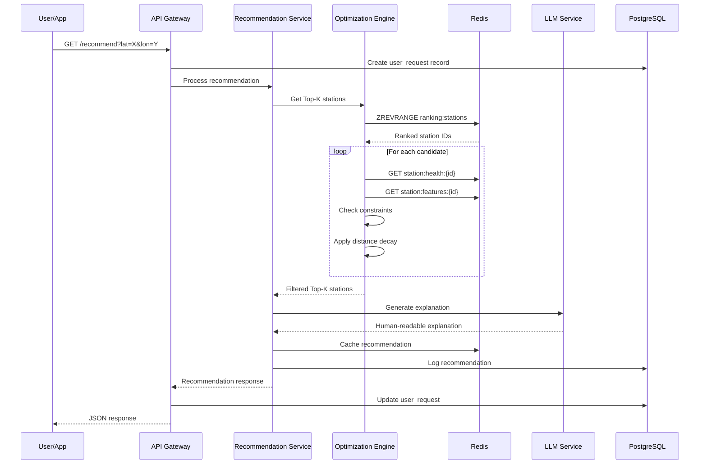

# 🔄 Workflow Documentation

Complete end-to-end workflow documentation for the EV Charging Recommendation Platform.

> **Navigation:** [README](../README.md) | [Implementation Guide](IMPLEMENTATION.md) | [API Reference](API_REFERENCE.md)

## System Workflows

### 1. Station Data Ingestion Workflow

```
┌─────────────┐
│  IoT Device │
│  or API     │
└──────┬──────┘
       │ HTTP POST /ingest/station
       ▼
┌──────────────────────────────────────────────────────────────┐
│                    INGESTION SERVICE                          │
├──────────────────────────────────────────────────────────────┤
│  1. Receive HTTP request                                      │
│  2. Validate payload with Zod schema                          │
│  3. Add timestamp if missing                                  │
│  4. Publish to Kafka 'station.telemetry' topic               │
│  5. Cache in Redis (key: station:telemetry:{id}, TTL: 30s)   │
│  6. Return 202 Accepted                                       │
└──────────────────────────────────────────────────────────────┘
       │
       │ Kafka message
       ▼
┌──────────────────────────────────────────────────────────────┐
│                 FEATURE ENGINEERING SERVICE                   │
├──────────────────────────────────────────────────────────────┤
│  1. Consume message from 'station.telemetry'                 │
│  2. Calculate derived features:                               │
│     - effectiveWaitTime = queueLength × avgServiceTime       │
│     - reliabilityScore = 1 - faultRate                       │
│     - energyStabilityIndex = availablePower / maxCapacity    │
│     - chargerAvailabilityRatio = available / total           │
│  3. Normalize all features to [0, 1]                         │
│  4. Publish to Kafka 'station.features' topic                │
│  5. Cache in Redis (key: station:features:{id})              │
└──────────────────────────────────────────────────────────────┘
       │
       │ Kafka message
       ▼
┌──────────────────────────────────────────────────────────────┐
│                    SCORING SERVICE                            │
├──────────────────────────────────────────────────────────────┤
│  1. Consume message from 'station.features'                  │
│  2. Fetch AI predictions from cache/external service         │
│  3. Calculate component scores                                │
│  4. Calculate weighted overall score                          │
│  5. Apply prediction adjustments                              │
│  6. Calculate confidence score                                │
│  7. Publish to Kafka 'station.scores'                        │
│  8. Cache in Redis (key: station:score:{id})                 │
│  9. Update Redis sorted set (ranking:stations)               │
└──────────────────────────────────────────────────────────────┘
```

---

### 2. Recommendation Request Workflow

```
┌─────────────┐
│ Mobile App  │
│ or Web UI   │
└──────┬──────┘
       │ GET /recommend?lat=X&lon=Y&userId=Z
       ▼
┌──────────────────────────────────────────────────────────────┐
│                      API GATEWAY                              │
├──────────────────────────────────────────────────────────────┤
│  1. Validate request parameters                               │
│  2. Create user request record in PostgreSQL                  │
│  3. Call Recommendation Service                               │
└────────────────────────┬─────────────────────────────────────┘
                         │
                         ▼
┌──────────────────────────────────────────────────────────────┐
│                 RECOMMENDATION SERVICE                        │
├──────────────────────────────────────────────────────────────┤
│  1. Generate unique request ID                                │
│  2. Call Optimization Engine                                  │
└────────────────────────┬─────────────────────────────────────┘
                         │
                         ▼
┌──────────────────────────────────────────────────────────────┐
│                  OPTIMIZATION ENGINE                          │
├──────────────────────────────────────────────────────────────┤
│  1. Get top candidates from Redis sorted set                 │
│  2. For each candidate:                                       │
│     a. Check health constraints                               │
│     b. Check capacity constraints                             │
│     c. Check fault probability constraints                    │
│     d. Calculate distance from user                           │
│     e. Apply distance decay to score                          │
│  3. Filter stations that pass all constraints                 │
│  4. Sort by adjusted score                                    │
│  5. Return Top-K results                                      │
└────────────────────────┬─────────────────────────────────────┘
                         │
                         ▼
┌──────────────────────────────────────────────────────────────┐
│               BACK TO RECOMMENDATION SERVICE                  │
├──────────────────────────────────────────────────────────────┤
│  3. Apply user preferences (boost fast chargers, etc.)       │
│  4. Call LLM Explanation Layer                                │
└────────────────────────┬─────────────────────────────────────┘
                         │
                         ▼
┌──────────────────────────────────────────────────────────────┐
│                  LLM EXPLANATION LAYER                        │
├──────────────────────────────────────────────────────────────┤
│  1. Build context (top station, alternatives, metrics)       │
│  2. Generate prompt from template                             │
│  3. Call OpenAI API (with circuit breaker)                   │
│  4. If API fails, use fallback template generator            │
│  5. Return human-readable explanation                         │
└────────────────────────┬─────────────────────────────────────┘
                         │
                         ▼
┌──────────────────────────────────────────────────────────────┐
│               BACK TO RECOMMENDATION SERVICE                  │
├──────────────────────────────────────────────────────────────┤
│  5. Assemble final recommendation response                    │
│  6. Log to recommendation_logs table                          │
│  7. Cache recommendation in Redis (TTL: 5 min)               │
│  8. Update metrics counters                                   │
│  9. Return response to API Gateway                            │
└────────────────────────┬─────────────────────────────────────┘
                         │
                         ▼
┌──────────────────────────────────────────────────────────────┐
│                      API GATEWAY                              │
├──────────────────────────────────────────────────────────────┤
│  4. Update user request record with response                  │
│  5. Return JSON response to client                            │
└──────────────────────────────────────────────────────────────┘
       │
       │ JSON Response
       ▼
┌─────────────────────────────────────────────────────────────┐
│                    RESPONSE EXAMPLE                          │
├─────────────────────────────────────────────────────────────┤
│  {                                                           │
│    "success": true,                                          │
│    "data": {                                                 │
│      "requestId": "REQ_abc123",                              │
│      "recommendations": [                                    │
│        {                                                     │
│          "stationId": "ST_101",                              │
│          "stationName": "Downtown EV Hub",                   │
│          "score": 0.87,                                      │
│          "rank": 1,                                          │
│          "estimatedWaitTime": 5,                             │
│          "estimatedDistance": 2.3                            │
│        },                                                    │
│        ...                                                   │
│      ],                                                      │
│      "explanation": "Downtown EV Hub is recommended..."      │
│    },                                                        │
│    "meta": { "processingTime": 145 }                         │
│  }                                                           │
└─────────────────────────────────────────────────────────────┘
```

---

### 3. AI Prediction Integration Workflow

```
┌──────────────────────────────────────────────────────────────┐
│                    SCORING SERVICE                            │
│              (needs AI predictions)                           │
└────────────────────────┬─────────────────────────────────────┘
                         │
                         ▼
┌──────────────────────────────────────────────────────────────┐
│                  CHECK REDIS CACHE                            │
├──────────────────────────────────────────────────────────────┤
│  Key: prediction:load:{stationId}                            │
│  Key: prediction:fault:{stationId}                           │
│                                                               │
│  Cache Hit?                                                   │
│    YES → Return cached prediction                             │
│    NO  → Continue to external service                         │
└────────────────────────┬─────────────────────────────────────┘
                         │ Cache Miss
                         ▼
┌──────────────────────────────────────────────────────────────┐
│              EXTERNAL AI SERVICE CALL                         │
├──────────────────────────────────────────────────────────────┤
│  1. Check circuit breaker state                               │
│     - CLOSED: Proceed with call                               │
│     - OPEN: Skip to fallback                                  │
│     - HALF-OPEN: Try one request                              │
│                                                               │
│  2. Make HTTP request with retry policy:                      │
│     - Max 3 attempts                                          │
│     - Exponential backoff (500ms → 1s → 2s)                  │
│                                                               │
│  3. On success:                                               │
│     - Cache response in Redis (TTL: 60s)                      │
│     - Reset circuit breaker failures                          │
│                                                               │
│  4. On failure:                                               │
│     - Increment circuit breaker failure count                 │
│     - If threshold reached, open circuit                      │
│     - Use fallback prediction                                 │
└────────────────────────┬─────────────────────────────────────┘
                         │
                         ▼
┌──────────────────────────────────────────────────────────────┐
│                FALLBACK PREDICTION                            │
├──────────────────────────────────────────────────────────────┤
│  Load Forecast:                                               │
│    - Check current hour for peak detection                    │
│    - Peak hours (7-9AM, 5-7PM): 70-95% load                  │
│    - Off-peak: 30-60% load                                    │
│                                                               │
│  Fault Prediction:                                            │
│    - Random 0-15% probability                                 │
│    - Risk level based on probability:                         │
│      <5%: low, 5-15%: medium, >15%: high                     │
└──────────────────────────────────────────────────────────────┘
```

---

### 4. Feedback Collection Workflow

```
┌─────────────┐
│ Mobile App  │
│ (User)      │
└──────┬──────┘
       │ POST /recommend/{requestId}/select
       │ { "stationId": "ST_101" }
       ▼
┌──────────────────────────────────────────────────────────────┐
│                      API GATEWAY                              │
├──────────────────────────────────────────────────────────────┤
│  1. Validate requestId and stationId                          │
│  2. Update recommendation_logs table:                         │
│     - Set selected_station_id                                 │
│     - Set selected_at timestamp                               │
│  3. Log selection event                                       │
│  4. Return 200 OK                                             │
└──────────────────────────────────────────────────────────────┘

┌─────────────┐
│ Mobile App  │
│ (User)      │
└──────┬──────┘
       │ POST /recommend/{requestId}/feedback
       │ { "rating": 5 }
       ▼
┌──────────────────────────────────────────────────────────────┐
│                      API GATEWAY                              │
├──────────────────────────────────────────────────────────────┤
│  1. Validate rating (1-5)                                     │
│  2. Update recommendation_logs table:                         │
│     - Set feedback rating                                     │
│  3. Log feedback event                                        │
│  4. Return 200 OK                                             │
│                                                               │
│  Note: Feedback can be used for:                              │
│    - Model retraining signals                                 │
│    - Scoring weight adjustments                               │
│    - User preference learning                                 │
└──────────────────────────────────────────────────────────────┘
```

---

### 5. Admin Dashboard Workflow

```
┌─────────────┐
│ Admin User  │
└──────┬──────┘
       │ GET /admin/summary
       ▼
┌──────────────────────────────────────────────────────────────┐
│                      API GATEWAY                              │
├──────────────────────────────────────────────────────────────┤
│  1. Query PostgreSQL for:                                     │
│     - Total stations count                                    │
│     - Stations by status                                      │
│     - Recommendations count today                             │
│     - Average response time                                   │
│                                                               │
│  2. Query Redis for:                                          │
│     - Top ranked stations                                     │
│     - Cache hit statistics                                    │
│                                                               │
│  3. Call LLM for narrative summary                            │
│                                                               │
│  4. Return combined response                                  │
└──────────────────────────────────────────────────────────────┘
       │
       │ JSON Response
       ▼
┌─────────────────────────────────────────────────────────────┐
│                    RESPONSE                                  │
├─────────────────────────────────────────────────────────────┤
│  {                                                           │
│    "data": {                                                 │
│      "totalStations": 50,                                    │
│      "operationalStations": 45,                              │
│      "degradedStations": 4,                                  │
│      "offlineStations": 1,                                   │
│      "recommendationsToday": 3420,                           │
│      "avgResponseTime": 145,                                 │
│      "systemHealth": "healthy"                               │
│    },                                                        │
│    "narrative": "Network status is healthy with 90%..."      │
│  }                                                           │
└─────────────────────────────────────────────────────────────┘
```

---

## Sequence Diagrams

### Recommendation Flow (Mermaid)



---

## Error Handling Workflows

### Kafka Consumer Error

```
Message received
       │
       ▼
┌─────────────────┐
│ Parse message   │
└────────┬────────┘
         │
    ┌────┴────┐
    │ Success │
    └────┬────┘
         │
         ▼
┌─────────────────┐
│ Process message │
└────────┬────────┘
         │
    ┌────┴────────────────────────┐
    │ Exception?                  │
    ├─────────────────────────────┤
    │ YES:                        │
    │   1. Log error with context │
    │   2. Skip message           │
    │   3. Continue consuming     │
    │                             │
    │ NO:                         │
    │   1. Commit offset          │
    │   2. Continue consuming     │
    └─────────────────────────────┘
```

### External Service Failure

```
API request
       │
       ▼
┌─────────────────────────────────────┐
│ Circuit Breaker Check               │
├─────────────────────────────────────┤
│ OPEN:                               │
│   → Return fallback immediately     │
│                                     │
│ CLOSED/HALF-OPEN:                   │
│   → Attempt request with retry      │
└────────────────┬────────────────────┘
                 │
                 ▼
┌─────────────────────────────────────┐
│ Retry Policy (3 attempts)           │
├─────────────────────────────────────┤
│ Success:                            │
│   → Reset failure count             │
│   → Cache response                  │
│   → Return result                   │
│                                     │
│ All retries failed:                 │
│   → Increment failure count         │
│   → If threshold reached:           │
│       → Open circuit                │
│   → Return fallback result          │
└─────────────────────────────────────┘
```

---

## Data Lifecycle

### Telemetry Data Lifecycle

```
┌─────────────────────────────────────────────────────────────┐
│                    DATA LIFECYCLE                            │
├─────────────────────────────────────────────────────────────┤
│                                                              │
│  IoT Device                                                  │
│      │                                                       │
│      │ Every 10-30 seconds                                   │
│      ▼                                                       │
│  Ingestion Service                                           │
│      │                                                       │
│      ├──────────────────────────────────────────┐            │
│      │                                          │            │
│      ▼                                          ▼            │
│  Redis Cache                              Kafka Topic        │
│  (TTL: 30s)                              (Retention: 24h)   │
│      │                                          │            │
│      │                                          │            │
│      ▼                                          ▼            │
│  Overwritten by                         Feature Service     │
│  next update                                   │            │
│                                                │            │
│                                                ▼            │
│                                          PostgreSQL         │
│                                      (station_history)      │
│                                                │            │
│                                                ▼            │
│                                          Cleanup Job        │
│                                       (Delete > 30 days)    │
│                                                              │
└─────────────────────────────────────────────────────────────┘
```

---

This workflow documentation provides a complete understanding of how data flows through the system and how each component interacts.

---

> **Navigation:** [Back to README](../README.md) | [Implementation Guide](IMPLEMENTATION.md) | [API Reference](API_REFERENCE.md)
